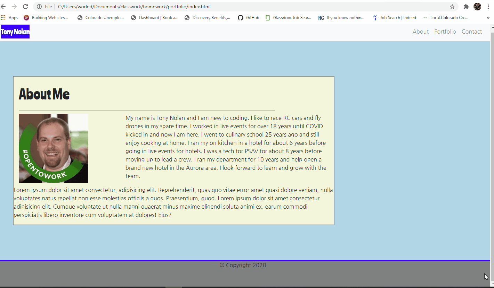

# portfolio

This is a homework project to create a responsive website about yourself.
The use of Bootstrap to help make the website responsive and much easier to code.

This project has responsive images and a responsive design.
The gird system was used to layout the site.

Bootstrap nav bar was used to create a nav bar at the top of the screen with working links to other pages in the project. 

Bootstrap grid system used to layout page design.

Validation service used to check HTML and no errors were found.

